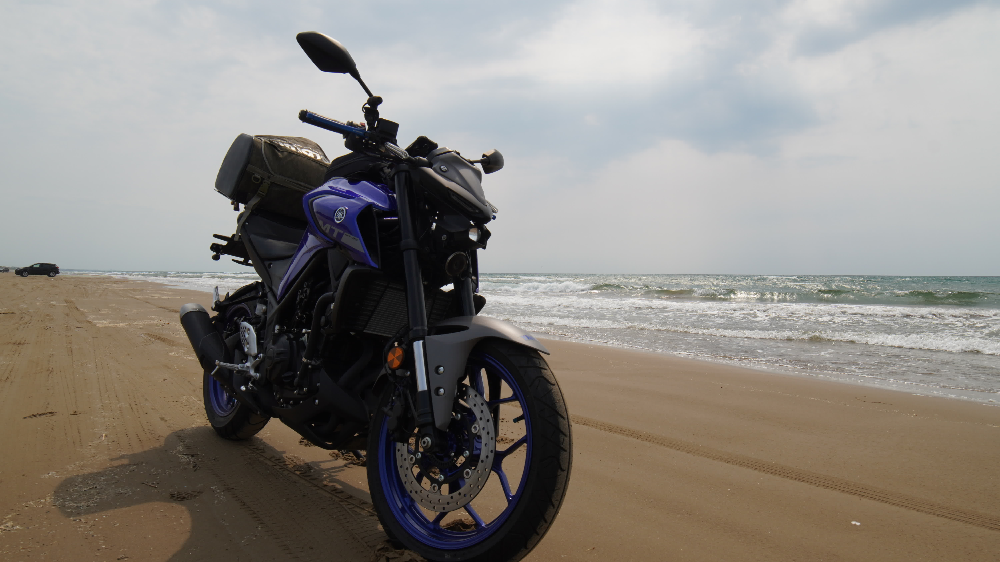

# このサイトについて

私の日本旅行の写真を載せたサイトです。

バイク: ヤマハMT-25  
車: スズキジムニー

</img>

誤字などを見つけたら、[GitHub](https://github.com/minebreaker/journey-in-japan)にプルリクエストを頂けると幸いです。

# 支援

[Amazon 欲しいものリスト](https://www.amazon.jp/hz/wishlist/ls/TU2U5BWI29NB?ref_=wl_share)

# ライセンス

ソースコード: GPL3 or later
写真: CC BY-SA 4.0

## オープンソース

* [normalize.css](https://github.com/necolas/normalize.css/blob/master/LICENSE.md)

[Top](/)
