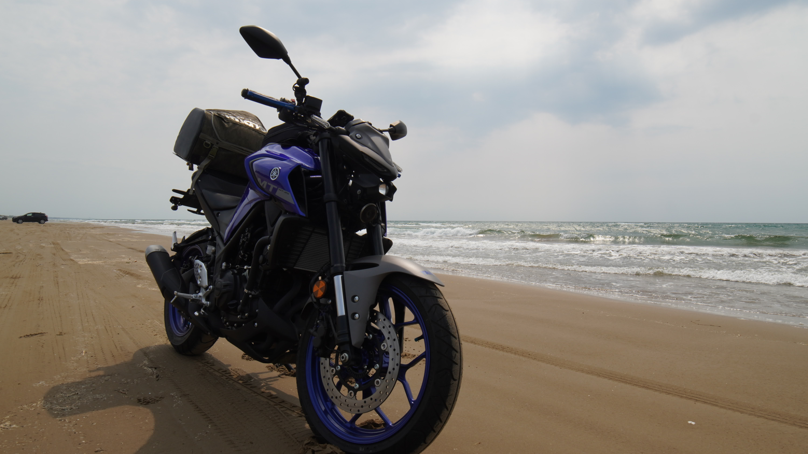

# About

Photos of my journey in Japan.

I'm a Japanese computer programmer, living in Hanno city, Saitama.

Motorcycle: YAMAHA MT-25  
Car: Suzuki Jimney

</img>

## Contact

Apparently I'm not good at English, so typo / grammar corrections are welcome.

Please make pull requests at

https://github.com/minebreaker/journey-in-japan

Email: `tkoyama at aaload.com`

*Note that the email may not be reliable.*

# License

Source codes: GPL3 or later  
Photos: CC BY-SA 4.0

## Open source

* [normalize.css](https://github.com/necolas/normalize.css/blob/master/LICENSE.md)

[Top](/)
